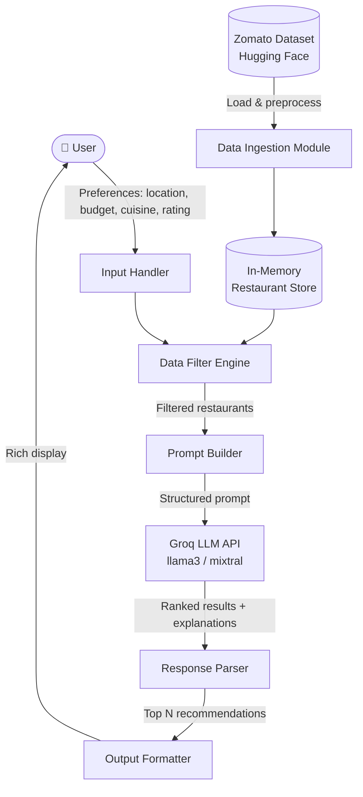
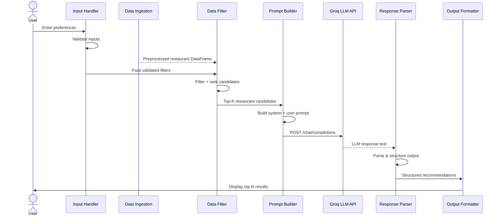

# Architecture: AI-Powered Restaurant Recommendation System

> **Project:** Zomato-Inspired Restaurant Recommender
> **LLM Provider:** [Groq](https://groq.com/) (ultra-fast inference)
> **Dataset:** [ManikaSaini/zomato-restaurant-recommendation](https://huggingface.co/datasets/ManikaSaini/zomato-restaurant-recommendation) on Hugging Face

---

## 1. High-Level Architecture



---

## 2. System Components

### 2.1 Data Ingestion Module

**Responsibility:** Load, clean, and normalize the Zomato dataset from Hugging Face.

| Sub-task | Details |
|---|---|
| **Source** | `datasets` library from Hugging Face |
| **Dataset** | `ManikaSaini/zomato-restaurant-recommendation` |
| **Fields Extracted** | `name`, `location`, `cuisines`, `cost_for_two`, `aggregate_rating`, `votes`, `online_order`, `book_table` |
| **Normalization** | Standardize budget tiers (Low / Medium / High) from cost values |
| **Storage** | Loaded into a Pandas DataFrame (in-memory) |

**Key Operations:**
- Strip null/empty records
- Normalize cuisine strings (lowercase, trim)
- Map cost ranges → budget categories
- Cache preprocessed data to avoid repeated loading

---

### 2.2 Input Handler

**Responsibility:** Collect and validate user preferences.

```
User Inputs:
  ├── location         → string  (e.g., "Bangalore")
  ├── cuisine          → string  (e.g., "Italian")
  ├── budget           → enum    (Low | Medium | High)
  ├── min_rating       → float   (e.g., 4.0)
  └── extra_prefs      → string  (e.g., "family-friendly, quick service")
```

**Validation Rules:**
- Location must be a non-empty string
- Budget mapped to cost ranges (Low: ≤500, Medium: 501–1200, High: >1200)
- Rating clamped between 0.0 – 5.0
- Extra preferences treated as optional free-text context for the LLM

---

### 2.3 Data Filter Engine

**Responsibility:** Query the in-memory restaurant store using structured user inputs.

```
Filter Pipeline:
  [All Restaurants]
       ↓  filter by location  (case-insensitive match)
       ↓  filter by cuisine   (substring match)
       ↓  filter by budget    (cost range)
       ↓  filter by rating    (min threshold)
       ↓  sort by votes + rating (descending)
       ↓  take top-K results  (default K=10)
  [Candidate Restaurants → Prompt Builder]
```

**Libraries:** `pandas`, `fuzzywuzzy` (optional fuzzy location matching)

---

### 2.4 Prompt Builder

**Responsibility:** Convert filtered restaurant data + user preferences into a structured LLM prompt.

**Prompt Template Design:**

```
System Prompt:
  "You are an expert restaurant recommendation assistant. 
   Analyze the provided restaurant data and user preferences, 
   then recommend the top 3–5 restaurants with clear reasoning."

User Prompt:
  "User Preferences:
     - Location: {location}
     - Cuisine: {cuisine}
     - Budget: {budget}
     - Minimum Rating: {min_rating}
     - Additional Preferences: {extra_prefs}

   Available Restaurants (filtered):
   {formatted_restaurant_list}

   Please rank the best restaurants and explain why each 
   one suits the user's preferences."
```

**Restaurant List Format per entry:**
```
[{index}] {name}
  - Cuisine: {cuisines}
  - Cost for Two: ₹{cost}
  - Rating: {rating} ⭐ ({votes} votes)
  - Online Order: {yes/no} | Table Booking: {yes/no}
```

---

### 2.5 Groq LLM Integration

**Responsibility:** Call the Groq API for fast LLM inference and receive ranked recommendations.

| Property | Value |
|---|---|
| **Provider** | [Groq Cloud](https://console.groq.com/) |
| **Recommended Model** | `llama3-8b-8192` or `mixtral-8x7b-32768` |
| **API Style** | OpenAI-compatible REST API |
| **Python SDK** | `groq` (`pip install groq`) |
| **Auth** | `GROQ_API_KEY` via environment variable |
| **Max Tokens** | 1024 (response) |
| **Temperature** | 0.5 (balanced: creative but consistent) |

**Sample API Call:**
```python
from groq import Groq

client = Groq(api_key=os.environ["GROQ_API_KEY"])

response = client.chat.completions.create(
    model="llama3-8b-8192",
    messages=[
        {"role": "system", "content": system_prompt},
        {"role": "user",   "content": user_prompt}
    ],
    max_tokens=1024,
    temperature=0.5
)

recommendation_text = response.choices[0].message.content
```

---

### 2.6 Response Parser

**Responsibility:** Parse and structure the raw LLM text output into a clean, consumable format.

**Output Schema (per recommendation):**
```json
{
  "rank": 1,
  "name": "Truffles",
  "cuisine": "American, Fast Food",
  "rating": 4.6,
  "cost_for_two": "₹600",
  "explanation": "Highly rated with over 10,000 votes, Truffles fits your medium budget and preference for quick service..."
}
```

**Parsing Strategy:**
- Use regex or structured output prompting to extract fields
- Fallback: return raw LLM text if structured parsing fails

---

### 2.7 Output Formatter

**Responsibility:** Render the final recommendations in a readable, user-friendly format.

**CLI Output Example:**
```
╔══════════════════════════════════════════════╗
║   🍽️  Top Restaurant Recommendations         ║
╚══════════════════════════════════════════════╝

#1 — Truffles
   📍 Cuisine  : American, Fast Food
   ⭐ Rating   : 4.6  (12,345 votes)
   💰 Cost/Two : ₹600 (Medium Budget)
   🤖 Why?     : Highly popular for quick bites with consistently
                  high ratings and great value for money...

#2 — Barbeque Nation
   ...
```

---

## 3. Data Flow Diagram



---

## 4. Project Folder Structure

```
zomato-restaurant_recommender/
│
├── docs/
│   ├── problemStatement.txt        # Original problem statement
│   ├── problemStatement.md         # Formatted problem statement
│   └── architecture.md             # This file
│
├── data/
│   └── zomato_preprocessed.csv     # Cached/preprocessed dataset (optional)
│
├── src/
│   ├── ingest.py                   # Data Ingestion Module
│   ├── filter.py                   # Data Filter Engine
│   ├── prompt_builder.py           # Prompt Builder
│   ├── groq_client.py              # Groq LLM Integration
│   ├── parser.py                   # Response Parser
│   └── formatter.py                # Output Formatter
│
├── main.py                         # Entry point — orchestrates all modules
├── config.py                       # Config: model name, cost tiers, top-K
├── .env                            # GROQ_API_KEY (not committed to git)
├── requirements.txt                # Python dependencies
└── README.md                       # Project overview
```

---

## 5. Technology Stack

| Layer | Technology | Purpose |
|---|---|---|
| **Language** | Python 3.10+ | Core implementation |
| **Dataset** | Hugging Face `datasets` | Load Zomato restaurant data |
| **Data Processing** | `pandas` | Filtering, normalization |
| **LLM Provider** | **Groq Cloud** | Ultra-fast LLM inference |
| **LLM Model** | `llama3-8b-8192` / `mixtral-8x7b-32768` | Reasoning & ranking |
| **LLM SDK** | `groq` Python library | API client |
| **Env Management** | `python-dotenv` | Manage API keys securely |
| **Fuzzy Matching** | `fuzzywuzzy` (optional) | Flexible location matching |
| **CLI Interface** | `rich` (optional) | Beautiful terminal output |

---

## 6. Key Design Decisions

| Decision | Rationale |
|---|---|
| **Groq over OpenAI** | Groq offers near-instant inference (~10x faster) — ideal for interactive recommendation UX |
| **In-memory DataFrame** | Dataset is small enough to fit in memory; avoids DB overhead |
| **Prompt-based ranking** | Leverages LLM's natural reasoning ability rather than complex ranking algorithms |
| **Top-K pre-filtering** | Limits LLM context window usage by passing only the most relevant candidates |
| **Modular src/ layout** | Each component is independently testable and replaceable |

---

## 7. Environment Setup

```bash
# 1. Clone the repo
git clone <repo-url>
cd zomato-restaurant_recommender

# 2. Create virtual environment
python -m venv venv
source venv/bin/activate   # Windows: venv\Scripts\activate

# 3. Install dependencies
pip install -r requirements.txt

# 4. Set your Groq API key
echo "GROQ_API_KEY=your_key_here" > .env

# 5. Run the app
python main.py
```

**`requirements.txt`:**
```
datasets
pandas
groq
python-dotenv
fuzzywuzzy
python-Levenshtein
rich
```

---

## 8. Extensibility & Future Enhancements

| Enhancement | Description |
|---|---|
| **Streamlit / Gradio UI** | Add a web-based frontend for broader accessibility |
| **Vector Search (RAG)** | Embed restaurant descriptions and use semantic similarity search |
| **Conversation History** | Enable multi-turn chat for refining recommendations |
| **Persistent Storage** | Move from in-memory to SQLite or PostgreSQL |
| **Groq Tool Calling** | Use function-calling to extract structured output directly from LLM |
| **User Feedback Loop** | Allow users to rate recommendations to improve future prompts |
