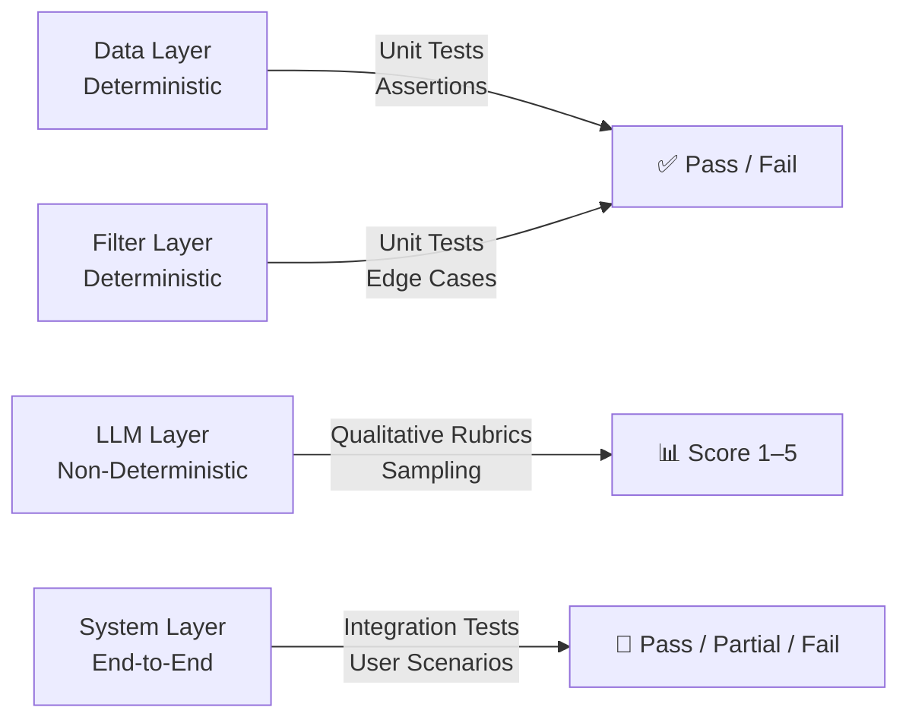

# Evaluation Plan: AI-Powered Restaurant Recommendation System
## Zomato × Groq LLM

> **Based on:** [implementation-plan.md](./implementation-plan.md) · [architecture.md](./architecture.md)
> **Purpose:** Define evaluation criteria, metrics, test cases, and quality benchmarks across every module and the system as a whole.

---

## Table of Contents

1. [Evaluation Philosophy](#1-evaluation-philosophy)
2. [Module-Level Unit Evaluations](#2-module-level-unit-evaluations)
3. [Integration Evaluation](#3-integration-evaluation)
4. [LLM Output Quality Evaluation](#4-llm-output-quality-evaluation)
5. [End-to-End System Evaluation](#5-end-to-end-system-evaluation)
6. [Performance Evaluation](#6-performance-evaluation)
7. [Robustness & Edge Case Evaluation](#7-robustness--edge-case-evaluation)
8. [Evaluation Scorecard](#8-evaluation-scorecard)

---

## 1. Evaluation Philosophy

This project combines **deterministic data processing** (ingestion, filtering) with **non-deterministic AI output** (Groq LLM). The evaluation strategy treats each layer differently:



| Layer | Evaluation Type | Measure |
|---|---|---|
| Data Ingestion | Automated assertions | Row count, null %, dtype correctness |
| Input Handler | Boundary testing | Valid/invalid input handling |
| Filter Engine | Functional testing | Precision, recall on known data |
| Prompt Builder | Structural checks | Token count, required fields present |
| Groq LLM | Qualitative rubric | Relevance, accuracy, explanation quality |
| Output Formatter | Visual/structural | Format correctness, no crashes |
| System E2E | Scenario testing | Full workflow success rate |

---

## 2. Module-Level Unit Evaluations

### 2.1 Data Ingestion — `src/ingest.py`

#### Test Cases

| Test ID | Description | Input | Expected Output | Pass Criteria |
|---|---|---|---|---|
| INGEST-01 | Dataset loads successfully | HuggingFace online | Non-empty DataFrame | `len(df) > 0` |
| INGEST-02 | No nulls in critical columns | Raw dataset | Cleaned DataFrame | `df[['name','location','cuisines','rating']].isnull().sum() == 0` |
| INGEST-03 | Cost is numeric | Raw cost column with commas | `float` dtype | `df['cost'].dtype == float64` |
| INGEST-04 | Rating is numeric and bounded | Rating column with `"NEW"` rows | `float` in `[0.0, 5.0]` | `df['rating'].between(0,5).all()` |
| INGEST-05 | Budget tier assigned correctly | Cost = 300 → `"low"` | `"low"` | `df.loc[df['cost']==300, 'budget_tier'].iloc[0] == 'low'` |
| INGEST-06 | Budget tier assigned correctly | Cost = 800 → `"medium"` | `"medium"` | Tier maps accurately |
| INGEST-07 | Budget tier assigned correctly | Cost = 2000 → `"high"` | `"high"` | Tier maps accurately |
| INGEST-08 | Votes column filled (no NaN) | Votes with NaN | `int` column, NaN → 0 | `df['votes'].isnull().sum() == 0` |
| INGEST-09 | Location is lowercase | `"Bangalore"` in raw data | `"bangalore"` | `df['location'].str.islower().all()` |
| INGEST-10 | Cache file created on first load | First run | `data/zomato_preprocessed.csv` exists | `os.path.exists(CACHE_PATH)` |

#### Eval Script Outline

```python
# eval/test_ingest.py

import pandas as pd
from src.ingest import load_restaurants

def eval_ingest():
    df = load_restaurants()

    results = {
        "INGEST-01 Non-empty":          len(df) > 0,
        "INGEST-02 No nulls (critical)": df[["name","location","cuisines","rating"]].isnull().sum().sum() == 0,
        "INGEST-03 Cost is float":       df["cost"].dtype == "float64",
        "INGEST-04 Rating in [0,5]":     df["rating"].between(0, 5).all(),
        "INGEST-05 Budget tier exists":  set(df["budget_tier"].unique()).issubset({"low","medium","high"}),
        "INGEST-06 Votes no NaN":        df["votes"].isnull().sum() == 0,
        "INGEST-07 Location lowercase":  df["location"].str.islower().all(),
    }

    for test, passed in results.items():
        status = "✅ PASS" if passed else "❌ FAIL"
        print(f"  {status} — {test}")

    score = sum(results.values())
    print(f"\n  Score: {score}/{len(results)}")
    return score

eval_ingest()
```

---

### 2.2 Input Handler — `src/input_handler.py`

#### Test Cases

| Test ID | Description | Simulated Input | Expected Behaviour |
|---|---|---|---|
| INPUT-01 | Valid full input | `"Bangalore", "Italian", "medium", "4.0", ""` | Returns dict with all 5 keys |
| INPUT-02 | Empty location rejected | `"", "Bangalore"` (retry) | Loops until valid |
| INPUT-03 | Invalid budget retried | `"cheap"` → `"low"` | Loops until valid budget |
| INPUT-04 | Non-numeric rating defaults | `"great"` | `min_rating = 3.5` |
| INPUT-05 | Rating clamped at 5.0 | `"6.5"` | `min_rating = 5.0` |
| INPUT-06 | Rating clamped at 0.0 | `"-2"` | `min_rating = 0.0` |
| INPUT-07 | Extra prefs optional | (Enter pressed) | `extra_prefs = ""` |
| INPUT-08 | Output keys present | Any valid input | Dict has `location, cuisine, budget, min_rating, extra_prefs` |

#### Evaluation Method
Simulate `input()` using `unittest.mock.patch` to inject test values programmatically.

```python
# eval/test_input.py

from unittest.mock import patch
from src.input_handler import get_user_preferences

def test_valid_input():
    inputs = iter(["Bangalore", "Italian", "medium", "4.0", "family-friendly"])
    with patch("builtins.input", lambda _: next(inputs)):
        prefs = get_user_preferences()
    assert set(prefs.keys()) == {"location", "cuisine", "budget", "min_rating", "extra_prefs"}
    assert prefs["budget"] == "medium"
    assert prefs["min_rating"] == 4.0
    print("✅ PASS — INPUT-01: Valid full input")

def test_invalid_rating_defaults():
    inputs = iter(["Bangalore", "any", "low", "great", ""])
    with patch("builtins.input", lambda _: next(inputs)):
        prefs = get_user_preferences()
    assert prefs["min_rating"] == 3.5
    print("✅ PASS — INPUT-04: Non-numeric rating defaults to 3.5")
```

---

### 2.3 Data Filter Engine — `src/filter.py`

#### Test Cases

| Test ID | Description | Input Preferences | Expected Outcome |
|---|---|---|---|
| FILTER-01 | Valid filter returns results | Bangalore, any, low, 3.0 | `len(result) > 0` |
| FILTER-02 | Location filter works | Location = "mumbai" | All rows have `"mumbai"` in location |
| FILTER-03 | Budget tier filter works | Budget = "medium" | All rows have `budget_tier == "medium"` |
| FILTER-04 | Rating filter works | min_rating = 4.5 | All rows have `rating >= 4.5` |
| FILTER-05 | Result count ≤ TOP_K | Any broad query | `len(result) <= TOP_K_FILTER` |
| FILTER-06 | Results sorted by rating desc | Any query | `result['rating'].is_monotonic_decreasing` |
| FILTER-07 | Unknown location returns empty | Location = "mars" | Empty DataFrame |
| FILTER-08 | Cuisine = "any" skips filter | any cuisine | No cuisine filter applied |

#### Precision Metric

For a known dataset subset, evaluate **filter precision**:

```
Precision = (Relevant results returned) / (Total results returned)

A result is "relevant" if:
  - location matches user input ✓
  - rating ≥ min_rating ✓
  - budget_tier matches ✓
  - (if cuisine ≠ "any") cuisine substring matches ✓
```

**Target: Precision = 1.0** (all returned results must be relevant — no false positives)

---

### 2.4 Prompt Builder — `src/prompt_builder.py`

#### Test Cases

| Test ID | Description | Expected |
|---|---|---|
| PROMPT-01 | System prompt is non-empty | `len(system_prompt) > 0` |
| PROMPT-02 | User prompt contains location | `prefs['location']` in user_prompt |
| PROMPT-03 | User prompt contains cuisine | `prefs['cuisine']` in user_prompt |
| PROMPT-04 | User prompt contains budget | `prefs['budget']` in user_prompt |
| PROMPT-05 | All candidates listed in prompt | All restaurant names appear in prompt |
| PROMPT-06 | Total token estimate within limit | `est_tokens < 6000` (leaving buffer for response) |
| PROMPT-07 | No `₹nan` or `₹0` in prompt | Cost field clean for all candidates |

#### Token Estimation

```python
def estimate_tokens(text: str) -> int:
    """Rough estimate: 1 token ≈ 4 characters."""
    return len(text) // 4

system_len = estimate_tokens(system_prompt)
user_len   = estimate_tokens(user_prompt)
total      = system_len + user_len

print(f"Estimated tokens: {total} / 8192")
assert total < 6000, f"❌ Prompt too long: {total} tokens"
```

---

## 3. Integration Evaluation

### 3.1 Module Integration Tests

Test that modules pass data correctly between each other without transformation errors.

| Test ID | Integration Point | Check |
|---|---|---|
| INT-01 | Ingest → Filter | DataFrame from ingest has all columns filter expects |
| INT-02 | Filter → Prompt Builder | Filtered DataFrame renders correctly in prompt |
| INT-03 | Prompt Builder → Groq Client | Tuple `(system, user)` accepted by Groq client |
| INT-04 | Groq Client → Formatter | String response renders without crash |
| INT-05 | Full pipeline (no LLM) | Dry-run with mocked Groq response completes successfully |

### 3.2 Mock LLM Integration Test

```python
# eval/test_integration.py

from unittest.mock import patch, MagicMock
from src.ingest          import load_restaurants
from src.filter          import filter_restaurants
from src.prompt_builder  import build_prompt
from src.groq_client     import get_recommendations
from src.formatter       import display_recommendations

MOCK_RESPONSE = """
#1 — Truffles
   Cuisine: American, Fast Food
   Why: Highly rated with great value for your medium budget...

#2 — Barbeque Nation
   Cuisine: North Indian, Barbeque
   Why: Family-friendly and perfect for groups...
"""

def test_full_pipeline_mocked():
    df = load_restaurants()

    prefs = {
        "location":    "bangalore",
        "cuisine":     "any",
        "budget":      "medium",
        "min_rating":  3.5,
        "extra_prefs": ""
    }

    candidates = filter_restaurants(df, prefs)
    assert not candidates.empty, "❌ INT-01: Filter returned empty"

    system_p, user_p = build_prompt(prefs, candidates)
    assert system_p and user_p, "❌ INT-02: Prompt build failed"

    with patch("src.groq_client.Groq") as MockGroq:
        mock_client = MagicMock()
        mock_client.chat.completions.create.return_value.choices[0].message.content = MOCK_RESPONSE
        MockGroq.return_value = mock_client
        response = get_recommendations(system_p, user_p)

    assert response == MOCK_RESPONSE, "❌ INT-03: Groq mock response mismatch"

    # Should not raise
    display_recommendations(response, prefs)
    print("✅ PASS — Full pipeline integration test (mocked LLM)")
```

---

## 4. LLM Output Quality Evaluation

Since LLM output is non-deterministic, quality is evaluated using a **rubric-based scoring system** applied to sampled outputs.

### 4.1 Evaluation Rubric (Per Response)

Each LLM response is scored on **5 dimensions**, each rated **1–5**:

| Dimension | 1 (Poor) | 3 (Adequate) | 5 (Excellent) |
|---|---|---|---|
| **Relevance** | Recommends restaurants not matching preferences | Partially matches preferences | All recommendations match all stated preferences |
| **Groundedness** | Invents restaurants not in provided list | Uses some restaurants from list | Uses only restaurants from the provided list |
| **Explanation Quality** | No explanation provided | Generic explanation | Specific, preference-driven reasoning for each pick |
| **Ranking Logic** | Random/unexplained order | Partially explained ranking | Clear, logical ranking with stated rationale |
| **Readability** | Unformatted, hard to read | Readable with minor issues | Clean, structured, easy to scan output |

**Maximum Score: 25 | Passing Threshold: ≥ 18 (72%)**

---

### 4.2 Sample Evaluation Prompts

Run the system with these standardized inputs and score each output using the rubric:

#### Eval Scenario A — Standard Query
```
Location:   Bangalore
Cuisine:    North Indian
Budget:     Medium
Min Rating: 4.0
Extra:      family-friendly
```

#### Eval Scenario B — Broad Query (Stress Test)
```
Location:   Delhi
Cuisine:    any
Budget:     Low
Min Rating: 3.0
Extra:      (none)
```

#### Eval Scenario C — Niche Query
```
Location:   Hyderabad
Cuisine:    Japanese
Budget:     High
Min Rating: 4.5
Extra:      quiet ambiance, good for dates
```

#### Eval Scenario D — Relaxed Filter (near-empty results)
```
Location:   Chennai
Cuisine:    Ethiopian
Budget:     Medium
Min Rating: 4.0
Extra:      (none)
```

---

### 4.3 Scoring Sheet Template

```
Evaluator: ___________   Date: ___________   Scenario: ___________

| Dimension           | Score (1–5) | Notes |
|---------------------|-------------|-------|
| Relevance           |             |       |
| Groundedness        |             |       |
| Explanation Quality |             |       |
| Ranking Logic       |             |       |
| Readability         |             |       |
| TOTAL               |    / 25     |       |

Pass: YES / NO   (threshold ≥ 18)
```

---

### 4.4 Hallucination Detection Check

After each LLM response, cross-reference recommended restaurant names against the `candidates` DataFrame:

```python
def check_hallucination(response_text: str, candidates_df: pd.DataFrame) -> dict:
    known_names = set(candidates_df["name"].str.lower().tolist())
    mentioned = re.findall(r"#\d+\s*[—–-]\s*(.+)", response_text)

    hallucinated = []
    for name in mentioned:
        if not any(known.lower() in name.lower() for known in known_names):
            hallucinated.append(name.strip())

    return {
        "total_recommended": len(mentioned),
        "hallucinated":      len(hallucinated),
        "hallucination_rate": len(hallucinated) / max(len(mentioned), 1),
        "hallucinated_names": hallucinated
    }
```

**Target Hallucination Rate: < 10%**

---

## 5. End-to-End System Evaluation

### 5.1 User Scenario Tests

| Scenario | Steps | Expected Outcome | Pass Criteria |
|---|---|---|---|
| **Happy Path** | Valid inputs → filter returns results → LLM responds | Top 3–5 recommendations displayed | Recommendations shown with explanations |
| **No Results (strict filter)** | Very specific query → 0 filter results | Relaxed filter message + results | App doesn't crash; suggests alternatives |
| **API Key Missing** | No `.env` file | Clear error at startup | `EnvironmentError` raised with helpful message |
| **HuggingFace Down** | Network unavailable | Falls back to CSV cache | Cache loaded; pipeline continues |
| **Groq Rate Limit** | Rapid repeated runs | Retry with backoff | Retries silently; eventual success or graceful failure |
| **Typo in Location** | `"bangalre"` | Fuzzy match suggestion | Correct city suggested or graceful empty-result message |

---

### 5.2 Output Quality Checklist (Per Run)

After each end-to-end run, verify:

```
[ ] At least 1 recommendation displayed
[ ] Each recommendation includes: name, cuisine, cost, rating
[ ] Each recommendation includes an AI-generated explanation
[ ] Explanation references user preferences (location / cuisine / budget)
[ ] No Python traceback visible to the user
[ ] No raw JSON or API error messages in output
[ ] No "₹nan" or "₹0" values displayed
[ ] Output is in English
```

---

## 6. Performance Evaluation

### 6.1 Timing Benchmarks

Measure elapsed time for each stage across 5 runs and report the average:

| Stage | Target Time | Critical Threshold |
|---|---|---|
| Dataset load (first run) | < 30 seconds | > 60 s = issue |
| Dataset load (cached) | < 2 seconds | > 5 s = issue |
| Filter engine | < 0.5 seconds | > 2 s = issue |
| Prompt construction | < 0.1 seconds | > 1 s = issue |
| **Groq API call** | **< 5 seconds** | > 15 s = issue |
| Total E2E (excl. user input) | < 10 seconds | > 30 s = issue |

```python
# eval/benchmark.py

import time
from src.ingest         import load_restaurants
from src.filter         import filter_restaurants
from src.prompt_builder import build_prompt

prefs = {"location":"bangalore","cuisine":"any","budget":"medium","min_rating":3.5,"extra_prefs":""}

t0 = time.time(); df = load_restaurants();    t1 = time.time()
t2 = time.time(); r  = filter_restaurants(df, prefs); t3 = time.time()
t4 = time.time(); build_prompt(prefs, r);     t5 = time.time()

print(f"Dataset Load : {t1-t0:.2f}s")
print(f"Filter       : {t3-t2:.4f}s")
print(f"Prompt Build : {t5-t4:.4f}s")
```

### 6.2 Groq Latency Benchmark

```python
# Measure Groq response time across 3 warm-up calls
import time
from src.groq_client import get_recommendations

times = []
for _ in range(3):
    t0 = time.time()
    get_recommendations(system_p, user_p)
    times.append(time.time() - t0)

print(f"Groq Avg Latency: {sum(times)/len(times):.2f}s")
print(f"Groq Min: {min(times):.2f}s | Max: {max(times):.2f}s")
```

---

## 7. Robustness & Edge Case Evaluation

Map each edge case from `edge-cases.md` to a specific eval test:

| EC ID | Description | Eval Test | Expected Result |
|---|---|---|---|
| EC-1.1 | HuggingFace offline | Disconnect network → run | CSV cache loaded; pipeline continues |
| EC-1.3 | Cost has commas | Assert `df['cost'].dtype == float64` | Pass |
| EC-1.4 | Rating = "NEW" | Assert no `"NEW"` in `df['rating']` | Pass |
| EC-2.1 | Empty location | Mock empty input → assert loop | Loop triggers; second input accepted |
| EC-2.4 | Non-numeric rating | Mock `"great"` → assert default | `min_rating == 3.5` |
| EC-3.1 | Zero results | Query for impossible combo | Empty message + relaxation trigger |
| EC-4.2 | Long extra prefs | Pass 500-char extra_prefs | Truncated to 200 chars in prompt |
| EC-5.1 | Missing API key | Remove `.env` | `EnvironmentError` with clear message |
| EC-5.2 | Rate limit | Mock 429 response | Retry with backoff; max 3 attempts |
| EC-5.3 | Empty LLM response | Mock empty string response | Fallback message displayed |
| EC-5.6 | LLM hallucination | Run hallucination check | Hallucination rate < 10% |
| EC-6.1 | `None` response | Mock `None` from Groq | Null guard triggers; no crash |
| EC-7.2 | `.env` in git | Check `.gitignore` content | `.env` listed |

---

## 8. Evaluation Scorecard

Use this scorecard after completing the full project to assess overall system quality:

### Module Health

| Module | Tests Written | Tests Passing | Score |
|---|---|---|---|
| Data Ingestion | 10 | ___/10 | ___% |
| Input Handler | 8 | ___/8 | ___% |
| Data Filter | 8 | ___/8 | ___% |
| Prompt Builder | 7 | ___/7 | ___% |
| Groq Integration | 6 | ___/6 | ___% |
| Output Formatter | 5 | ___/5 | ___% |
| Integration Tests | 5 | ___/5 | ___% |

---

### LLM Quality Rubric Scores

| Scenario | Relevance | Groundedness | Explanation | Ranking | Readability | Total /25 | Pass? |
|---|---|---|---|---|---|---|---|
| A — Standard | | | | | | | |
| B — Broad | | | | | | | |
| C — Niche | | | | | | | |
| D — Relaxed | | | | | | | |

---

### Performance Benchmarks

| Stage | Measured Time | Target | Status |
|---|---|---|---|
| Dataset load (cached) | ___s | < 2s | |
| Filter engine | ___s | < 0.5s | |
| Groq API call | ___s | < 5s | |
| Total E2E | ___s | < 10s | |

---

### Hallucination Rate

| Run | Total Recommended | Hallucinated | Rate | Pass (<10%)? |
|---|---|---|---|---|
| Run 1 | | | | |
| Run 2 | | | | |
| Run 3 | | | | |
| **Average** | | | | |

---

### Overall Project Grade

| Category | Weight | Max Score | Your Score |
|---|---|---|---|
| Unit Tests Passing | 30% | 30 | |
| LLM Quality Rubric | 30% | 30 | |
| Edge Case Handling | 20% | 20 | |
| Performance Benchmarks | 10% | 10 | |
| Code Readability / Structure | 10% | 10 | |
| **Total** | 100% | **100** | |

> **Passing Grade: ≥ 70 / 100**
