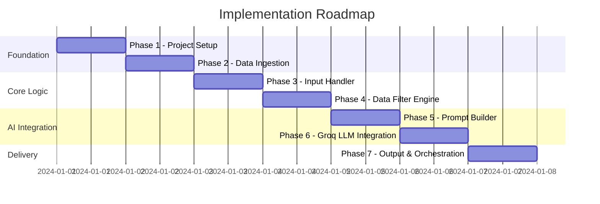
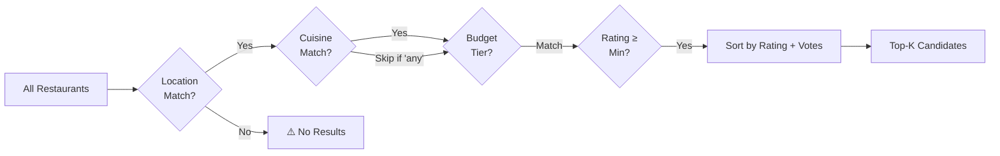
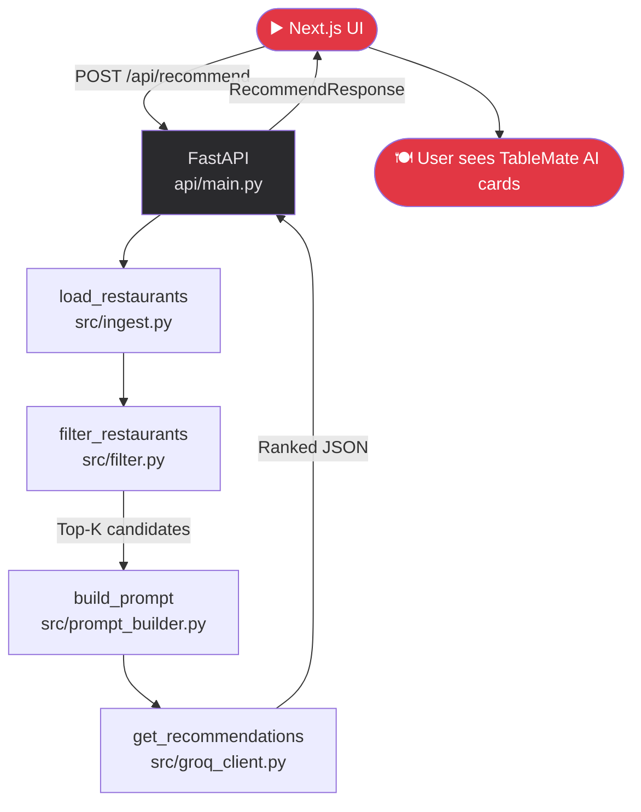

# Phase-Wise Implementation Plan
## AI-Powered Restaurant Recommendation System (Zomato × Groq)

> **Based on:** [problemStatement.md](./problemStatement.md) · [architecture.md](./architecture.md)
> **LLM:** Groq (`llama3-8b-8192`)
> **Total Phases:** 7
> **Recommended Timeline:** ~2–3 days (self-paced learning project)

---

## Overview



---

## Phase 1: Project Setup & Environment

### Goal
Establish a clean, reproducible Python project structure with all dependencies installed and secrets configured.

### Tasks

| # | Task | Details |
|---|---|---|
| 1.1 | Create project folder structure | As defined in `architecture.md` Section 4 |
| 1.2 | Initialize virtual environment | `python -m venv venv` |
| 1.3 | Create `requirements.txt` | List all dependencies |
| 1.4 | Install dependencies | `pip install -r requirements.txt` |
| 1.5 | Create `.env` file | Store `GROQ_API_KEY` securely |
| 1.6 | Create `config.py` | Centralized config constants |
| 1.7 | Create `.gitignore` | Exclude `.env`, `venv/`, `__pycache__/` |
| 1.8 | Verify Groq API key | Quick smoke test against Groq console |

### Files to Create

```
zomato-restaurant_recommender/
├── src/
│   ├── __init__.py
│   ├── ingest.py           ← placeholder
│   ├── filter.py           ← placeholder
│   ├── prompt_builder.py   ← placeholder
│   ├── groq_client.py      ← placeholder
│   ├── parser.py           ← placeholder
│   └── formatter.py        ← placeholder
├── main.py                 ← placeholder
├── config.py
├── .env
├── .gitignore
└── requirements.txt
```

### `requirements.txt`
```
datasets
pandas
groq
python-dotenv
fuzzywuzzy
python-Levenshtein
rich
```

### `config.py`
```python
# config.py — Central configuration

GROQ_MODEL        = "llama3-8b-8192"
GROQ_MAX_TOKENS   = 1024
GROQ_TEMPERATURE  = 0.5

HF_DATASET_NAME   = "ManikaSaini/zomato-restaurant-recommendation"
HF_DATASET_SPLIT  = "train"

TOP_K_FILTER      = 10       # Max restaurants passed to LLM

BUDGET_TIERS = {
    "low":    (0,   500),
    "medium": (501, 1200),
    "high":   (1201, float("inf"))
}
```

### ✅ Phase 1 Done When:
- [ ] All folders and placeholder files exist
- [ ] `pip install -r requirements.txt` completes without errors
- [ ] `.env` contains a valid `GROQ_API_KEY`
- [ ] `python -c "from groq import Groq; print('Groq OK')"` passes

---

## Phase 2: Data Ingestion Module

### Goal
Load the Zomato Hugging Face dataset, clean it, normalize fields, and expose a ready-to-query Pandas DataFrame.

### File: `src/ingest.py`

### Tasks

| # | Task | Details |
|---|---|---|
| 2.1 | Load dataset from Hugging Face | Use `datasets.load_dataset()` |
| 2.2 | Convert to Pandas DataFrame | `.to_pandas()` |
| 2.3 | Inspect and print column names | Understand available fields |
| 2.4 | Drop rows with null critical fields | `name`, `location`, `cuisines`, `cost`, `rating` |
| 2.5 | Normalize text fields | `.str.lower().str.strip()` for location, cuisine |
| 2.6 | Map cost → budget tier | Using `BUDGET_TIERS` from `config.py` |
| 2.7 | Persist preprocessed data (optional) | Save to `data/zomato_preprocessed.csv` |
| 2.8 | Expose `load_restaurants()` function | Returns clean DataFrame |

### Implementation Outline

```python
# src/ingest.py

from datasets import load_dataset
import pandas as pd
from config import HF_DATASET_NAME, HF_DATASET_SPLIT, BUDGET_TIERS

def map_budget(cost: float) -> str:
    for tier, (low, high) in BUDGET_TIERS.items():
        if low <= cost <= high:
            return tier
    return "high"

def load_restaurants() -> pd.DataFrame:
    """Load, clean, and return Zomato restaurant DataFrame."""
    dataset = load_dataset(HF_DATASET_NAME, split=HF_DATASET_SPLIT)
    df = dataset.to_pandas()

    # Keep only relevant columns
    cols = ["name", "location", "cuisines", "approx_cost(for two people)",
            "aggregate rating", "votes", "online_order", "book_table"]
    df = df[[c for c in cols if c in df.columns]].copy()

    # Rename for convenience
    df.rename(columns={
        "approx_cost(for two people)": "cost",
        "aggregate rating": "rating"
    }, inplace=True)

    # Clean & normalize
    df.dropna(subset=["name", "location", "cuisines", "rating"], inplace=True)
    df["location"] = df["location"].str.lower().str.strip()
    df["cuisines"] = df["cuisines"].str.lower().str.strip()
    df["cost"]     = pd.to_numeric(df["cost"].astype(str).str.replace(",", ""), errors="coerce")
    df["rating"]   = pd.to_numeric(df["rating"], errors="coerce")
    df.dropna(subset=["cost", "rating"], inplace=True)

    # Add budget tier
    df["budget_tier"] = df["cost"].apply(map_budget)

    return df.reset_index(drop=True)
```

### ✅ Phase 2 Done When:
- [ ] `load_restaurants()` returns a clean, non-empty DataFrame
- [ ] Columns: `name`, `location`, `cuisines`, `cost`, `rating`, `votes`, `budget_tier`
- [ ] No null values in critical columns
- [ ] `df["budget_tier"].value_counts()` shows sensible distribution

---

## Phase 3: Input Handler

### Goal
Collect user preferences from the terminal (CLI), validate them, and return a structured preferences dictionary.

### File: `src/input_handler.py`

### Tasks

| # | Task | Details |
|---|---|---|
| 3.1 | Define `UserPreferences` dataclass / dict schema | Structured user input container |
| 3.2 | Prompt user for location | Non-empty string |
| 3.3 | Prompt user for cuisine | Optional; default = "any" |
| 3.4 | Prompt user for budget | Validate: low / medium / high |
| 3.5 | Prompt user for minimum rating | Float, 0.0 – 5.0 |
| 3.6 | Prompt user for extra preferences | Optional free text |
| 3.7 | Validate and sanitize all inputs | Return clean `dict` |

### Implementation Outline

```python
# src/input_handler.py

from config import BUDGET_TIERS

def get_user_preferences() -> dict:
    """Interactively collect and validate user preferences."""
    print("\n🍽️  Welcome to the Zomato AI Recommender!\n")

    location = input("📍 Enter location (e.g., Bangalore): ").strip()
    while not location:
        location = input("   Location cannot be empty. Try again: ").strip()

    cuisine = input("🍜 Preferred cuisine (or press Enter for any): ").strip() or "any"

    budget = input("💰 Budget [low / medium / high]: ").strip().lower()
    while budget not in BUDGET_TIERS:
        budget = input("   Invalid. Choose from low / medium / high: ").strip().lower()

    try:
        min_rating = float(input("⭐ Minimum rating (0.0 – 5.0): ").strip())
        min_rating = max(0.0, min(5.0, min_rating))
    except ValueError:
        min_rating = 3.5

    extra = input("✨ Any extra preferences? (e.g., family-friendly): ").strip()

    return {
        "location":   location.lower(),
        "cuisine":    cuisine.lower(),
        "budget":     budget,
        "min_rating": min_rating,
        "extra_prefs": extra
    }
```

### ✅ Phase 3 Done When:
- [ ] `get_user_preferences()` handles invalid inputs gracefully
- [ ] Returns a clean dict with all 5 keys
- [ ] Budget defaults to validation loop if unrecognized value is entered
- [ ] Rating clamps correctly between 0.0 – 5.0

---

## Phase 4: Data Filter Engine

### Goal
Apply user preferences as filters on the Pandas DataFrame to return the top-K most relevant restaurant candidates.

### File: `src/filter.py`

### Tasks

| # | Task | Details |
|---|---|---|
| 4.1 | Filter by location | Case-insensitive substring match |
| 4.2 | Filter by cuisine | Substring match (skip if "any") |
| 4.3 | Filter by budget tier | Exact match on `budget_tier` column |
| 4.4 | Filter by minimum rating | `rating >= min_rating` |
| 4.5 | Sort results | Descending by `rating`, then `votes` |
| 4.6 | Return top-K candidates | Default K=10 from `config.py` |
| 4.7 | Handle empty results | Warn user and relax filters if needed |

### Filter Pipeline



### Implementation Outline

```python
# src/filter.py

import pandas as pd
from config import TOP_K_FILTER

def filter_restaurants(df: pd.DataFrame, prefs: dict) -> pd.DataFrame:
    """Filter restaurants based on user preferences."""
    filtered = df.copy()

    # Location filter
    filtered = filtered[filtered["location"].str.contains(prefs["location"], na=False)]

    # Cuisine filter
    if prefs["cuisine"] != "any":
        filtered = filtered[filtered["cuisines"].str.contains(prefs["cuisine"], na=False)]

    # Budget filter
    filtered = filtered[filtered["budget_tier"] == prefs["budget"]]

    # Rating filter
    filtered = filtered[filtered["rating"] >= prefs["min_rating"]]

    # Sort: rating DESC, votes DESC
    filtered = filtered.sort_values(["rating", "votes"], ascending=[False, False])

    if filtered.empty:
        print("⚠️  No restaurants matched your criteria. Try relaxing your filters.")
        return pd.DataFrame()

    return filtered.head(TOP_K_FILTER).reset_index(drop=True)
```

### ✅ Phase 4 Done When:
- [ ] Filter correctly narrows results for a sample input
- [ ] Empty result case is handled with a user-friendly message
- [ ] Returns ≤ `TOP_K_FILTER` rows sorted by rating + votes

---

## Phase 5: Prompt Builder

### Goal
Transform filtered restaurant data + user preferences into a well-structured LLM prompt that enables accurate reasoning and ranking.

### File: `src/prompt_builder.py`

### Tasks

| # | Task | Details |
|---|---|---|
| 5.1 | Define `SYSTEM_PROMPT` constant | Expert recommender persona |
| 5.2 | Format each restaurant as a numbered entry | Name, cuisine, cost, rating, votes |
| 5.3 | Build user prompt with preferences + restaurant list | Full context for the LLM |
| 5.4 | Instruct LLM output format | Ask for ranked list + explanations |
| 5.5 | Return (system_prompt, user_prompt) tuple | Ready for Groq API |

### Implementation Outline

```python
# src/prompt_builder.py

import pandas as pd

SYSTEM_PROMPT = """You are an expert restaurant recommendation assistant.
Your job is to analyze a list of restaurants and the user's preferences,
then recommend the top 3-5 restaurants in ranked order.
For each recommendation, provide:
1. The restaurant name and rank
2. A concise explanation (2-3 sentences) of why it matches the user's preferences
Be specific, helpful, and conversational in tone."""

def format_restaurant_list(df: pd.DataFrame) -> str:
    lines = []
    for i, row in df.iterrows():
        lines.append(
            f"[{i+1}] {row['name']}\n"
            f"    Cuisine: {row['cuisines']}\n"
            f"    Cost for Two: ₹{int(row['cost'])}\n"
            f"    Rating: {row['rating']} ⭐ ({int(row.get('votes', 0))} votes)\n"
        )
    return "\n".join(lines)

def build_prompt(prefs: dict, candidates: pd.DataFrame) -> tuple[str, str]:
    restaurant_list = format_restaurant_list(candidates)

    user_prompt = f"""User Preferences:
- Location: {prefs['location'].title()}
- Cuisine: {prefs['cuisine'].title()}
- Budget: {prefs['budget'].title()} (₹{get_budget_range(prefs['budget'])})
- Minimum Rating: {prefs['min_rating']} ⭐
- Additional Preferences: {prefs['extra_prefs'] or 'None'}

Available Restaurants:
{restaurant_list}

Please rank the top 3-5 restaurants and explain why each suits this user."""

    return SYSTEM_PROMPT, user_prompt

def get_budget_range(tier: str) -> str:
    ranges = {"low": "up to ₹500", "medium": "₹501–₹1200", "high": "₹1200+"}
    return ranges.get(tier, "")
```

### ✅ Phase 5 Done When:
- [ ] `build_prompt()` returns a valid (system, user) tuple
- [ ] Restaurant list is readable and well-formatted
- [ ] All user preferences are embedded in the prompt

---

## Phase 6: Groq LLM Integration

### Goal
Send the constructed prompt to Groq's API and receive a ranked recommendation response.

### File: `src/groq_client.py`

### Tasks

| # | Task | Details |
|---|---|---|
| 6.1 | Load `GROQ_API_KEY` from `.env` | Use `python-dotenv` |
| 6.2 | Instantiate Groq client | `Groq(api_key=...)` |
| 6.3 | Build chat messages list | `[system, user]` roles |
| 6.4 | Call `client.chat.completions.create()` | With model, tokens, temperature |
| 6.5 | Extract response text | `response.choices[0].message.content` |
| 6.6 | Handle API errors gracefully | Rate limits, auth errors, timeouts |
| 6.7 | Return raw LLM response string | For the parser |

### Implementation Outline

```python
# src/groq_client.py

import os
from groq import Groq
from dotenv import load_dotenv
from config import GROQ_MODEL, GROQ_MAX_TOKENS, GROQ_TEMPERATURE

load_dotenv()

def get_recommendations(system_prompt: str, user_prompt: str) -> str:
    """Send prompt to Groq and return LLM response text."""
    client = Groq(api_key=os.environ["GROQ_API_KEY"])

    try:
        response = client.chat.completions.create(
            model=GROQ_MODEL,
            messages=[
                {"role": "system", "content": system_prompt},
                {"role": "user",   "content": user_prompt}
            ],
            max_tokens=GROQ_MAX_TOKENS,
            temperature=GROQ_TEMPERATURE
        )
        return response.choices[0].message.content

    except Exception as e:
        print(f"❌ Groq API Error: {e}")
        return None
```

### ✅ Phase 6 Done When:
- [ ] `get_recommendations()` returns a non-null string for valid prompts
- [ ] API key loads correctly from `.env`
- [ ] Error handling catches and logs API failures without crashing

---

## Phase 7: API Layer & Orchestration

### Goal
Expose the recommendation engine as a **FastAPI REST API** so the Next.js frontend can consume it. Also keep a CLI fallback for local testing.

### Files: `api/main.py` + `src/formatter.py` + `main.py`

### Tasks

| # | Task | Details |
|---|---|---|
| 7.1 | Create `api/main.py` with FastAPI app | CORS-enabled, `/api/recommend` POST endpoint |
| 7.2 | Define `RecommendRequest` Pydantic model | Validates incoming JSON from the frontend |
| 7.3 | Define `RecommendResponse` Pydantic model | Structured JSON with ranked recommendations |
| 7.4 | Wire all backend modules into the handler | ingest → filter → prompt → Groq → format |
| 7.5 | Parse LLM markdown response into JSON array | So frontend can render individual cards |
| 7.6 | Add `formatter.py` for CLI output | Keep CLI usable for local debugging |
| 7.7 | Add `main.py` CLI entry point | `python main.py` still works as fallback |
| 7.8 | Add `requirements.txt` FastAPI/uvicorn entries | `fastapi`, `uvicorn[standard]` |
| 7.9 | Run full integration test via CLI and cURL | Validate both delivery modes |

### `api/main.py` — FastAPI Server

```python
# api/main.py

from fastapi import FastAPI, HTTPException
from fastapi.middleware.cors import CORSMiddleware
from pydantic import BaseModel, Field
from typing import List, Optional
from src.ingest import load_restaurants
from src.filter import filter_restaurants
from src.prompt_builder import build_prompt
from src.groq_client import get_recommendations
import re, os

app = FastAPI(title="TableMate AI API", version="1.0.0")

app.add_middleware(
    CORSMiddleware,
    allow_origins=["http://localhost:3000"],   # Next.js dev server
    allow_methods=["POST", "GET", "OPTIONS"],
    allow_headers=["*"],
)

# Load data once at startup
df = load_restaurants()

class RecommendRequest(BaseModel):
    location:   str          = Field(..., min_length=1)
    cuisine:    str          = "any"
    budget:     str          = Field(..., pattern="^(low|medium|high)$")
    min_rating: float        = Field(3.5, ge=0.0, le=5.0)
    extra_prefs: Optional[str] = ""

class Restaurant(BaseModel):
    rank:        int
    name:        str
    cuisine:     str
    cost:        int
    rating:      float
    votes:       int
    location:    str
    ai_summary:  str

class RecommendResponse(BaseModel):
    query_summary: str
    considered:    int
    restaurants:   List[Restaurant]

@app.post("/api/recommend", response_model=RecommendResponse)
def recommend(req: RecommendRequest):
    prefs = req.dict()
    candidates = filter_restaurants(df, prefs)
    if candidates.empty:
        raise HTTPException(status_code=404, detail="No restaurants matched. Try relaxing filters.")
    system_prompt, user_prompt = build_prompt(prefs, candidates)
    raw = get_recommendations(system_prompt, user_prompt)
    if not raw:
        raise HTTPException(status_code=502, detail="LLM did not return a response.")
    restaurants = parse_llm_response(raw, candidates)
    return RecommendResponse(
        query_summary=f"{len(candidates)} restaurants considered in {req.location.title()}",
        considered=len(candidates),
        restaurants=restaurants
    )

def parse_llm_response(raw: str, candidates) -> List[dict]:
    """Best-effort parser: map LLM ranked entries back to candidate rows."""
    results = []
    for i, row in candidates.head(5).iterrows():
        pattern = re.compile(re.escape(row["name"]), re.IGNORECASE)
        snippet = ""
        for line in raw.split("\n"):
            if pattern.search(line):
                snippet = line.strip()
                break
        results.append({
            "rank":       len(results) + 1,
            "name":       row["name"],
            "cuisine":    row["cuisines"],
            "cost":       int(row["cost"]),
            "rating":     round(float(row["rating"]), 1),
            "votes":      int(row.get("votes", 0)),
            "location":   row["location"].title(),
            "ai_summary": snippet or "Highly rated match for your preferences.",
        })
    return results
```

### `src/formatter.py` — CLI Display

```python
# src/formatter.py

def display_recommendations(response_text: str, prefs: dict):
    """Display formatted recommendations to the user."""
    print("\n" + "═" * 55)
    print("   🍽️  AI Restaurant Recommendations")
    print("═" * 55)
    print(f"  📍 {prefs['location'].title()} | "
          f"🍜 {prefs['cuisine'].title()} | "
          f"💰 {prefs['budget'].title()} | "
          f"⭐ {prefs['min_rating']}+")
    print("═" * 55 + "\n")
    if response_text:
        print(response_text)
    else:
        print("⚠️  Could not generate recommendations. Please try again.")
    print("\n" + "═" * 55)
```

### `main.py` — CLI Fallback

```python
# main.py

from src.ingest         import load_restaurants
from src.input_handler  import get_user_preferences
from src.filter         import filter_restaurants
from src.prompt_builder import build_prompt
from src.groq_client    import get_recommendations
from src.formatter      import display_recommendations

def main():
    print("⏳ Loading restaurant data...")
    df = load_restaurants()
    print(f"✅ Loaded {len(df)} restaurants.\n")
    prefs = get_user_preferences()
    candidates = filter_restaurants(df, prefs)
    if candidates.empty:
        return
    print(f"\n🔍 Found {len(candidates)} matching restaurants. Asking AI...\n")
    system_prompt, user_prompt = build_prompt(prefs, candidates)
    response = get_recommendations(system_prompt, user_prompt)
    display_recommendations(response, prefs)

if __name__ == "__main__":
    main()
```

### ✅ Phase 7 Done When:
- [ ] `uvicorn api.main:app --reload` starts without errors
- [ ] `POST /api/recommend` returns valid JSON for a sample payload
- [ ] `python main.py` CLI still works end-to-end
- [ ] CORS headers allow requests from `localhost:3000`
- [ ] LLM response is parsed into a typed `Restaurant` array

---

## End-to-End Flow Summary



---

## Implementation Checklist

| Phase | Description | Status |
|---|---|---|
| ✅ Phase 1 | Project Setup & Environment | `[ ]` |
| ✅ Phase 2 | Data Ingestion Module | `[ ]` |
| ✅ Phase 3 | Input Handler | `[ ]` |
| ✅ Phase 4 | Data Filter Engine | `[ ]` |
| ✅ Phase 5 | Prompt Builder | `[ ]` |
| ✅ Phase 6 | Groq LLM Integration | `[ ]` |
| ✅ Phase 7 | API Layer & Orchestration | `[ ]` |
| ✅ Phase 8 | Next.js Frontend (TableMate AI) | `[ ]` |

---

## Common Pitfalls & Tips

| Pitfall | Solution |
|---|---|
| HuggingFace dataset column names vary | Always print `df.columns` after loading |
| Cost column may have commas (`1,200`) | Strip commas before `pd.to_numeric()` |
| Rating stored as string (`"4.1"`) | Cast with `pd.to_numeric(..., errors='coerce')` |
| Groq rate limits on free tier | Add `time.sleep(1)` between retries |
| LLM response unparseable | Always have a raw-text fallback display |
| No restaurants found after filtering | Log which filter eliminated all rows for debugging |
| CORS errors in Next.js dev | Ensure FastAPI `allow_origins` includes `localhost:3000` |
| Next.js `fetch` to Python backend fails | Use `NEXT_PUBLIC_API_URL` env var for the backend URL |

---

## Phase 8: Next.js Frontend — TableMate AI

### Goal
Build a **production-quality, responsive web application** that implements the **TableMate AI Design System** from `stitch_tablemate_ai_recommendation_engine/DESIGN.md`. The UI connects to the Phase 7 FastAPI backend and presents ranked recommendations as premium restaurant cards.

### Design Reference

> Design system defined in [`DESIGN.md`](../stitch_tablemate_ai_recommendation_engine/DESIGN.md)  
> UI prototype in [`code.html`](../stitch_tablemate_ai_recommendation_engine/code.html)  
> Visual target: [`screen.png`](../stitch_tablemate_ai_recommendation_engine/screen.png)

**Core Design Principles:**
- **Premium Dark** aesthetic — deep charcoal backgrounds (`#131316`, `#0F0F12`)
- **Glassmorphism** navigation bar with `backdrop-filter: blur(20px)`
- **Coral primary** (`#E23744`) for CTAs; **Amber gold** (`#F5A623`) for ratings
- **Inter** font family throughout, variable weight hierarchy
- 12-column fluid grid desktop / single-column mobile
- Skeleton loaders, micro-animations, smooth transitions

---

### Tech Stack

| Layer | Choice | Reason |
|---|---|---|
| Framework | **Next.js 14** (App Router) | SSR, file-based routing, API proxying |
| Language | **TypeScript** | Type-safe API contracts matching Pydantic models |
| Styling | **CSS Modules + CSS Variables** | Full control over TableMate AI tokens |
| Icons | **Material Symbols Outlined** (Google Fonts) | Matches existing HTML prototype |
| Font | **Inter** (Google Fonts) | Design system requirement |
| HTTP | **fetch** with SWR | Streaming-friendly, lightweight |
| State | **React `useState` / `useReducer`** | No over-engineering for this scope |

---

### Folder Structure

```
frontend/
├── app/
│   ├── layout.tsx             ← Root layout (Inter font, CSS vars, metadata)
│   ├── page.tsx               ← Discover page (main recommender UI)
│   ├── saved/
│   │   └── page.tsx           ← Saved restaurants page
│   ├── history/
│   │   └── page.tsx           ← Search history page
│   └── globals.css            ← CSS custom properties (design tokens)
├── components/
│   ├── layout/
│   │   ├── Sidebar.tsx        ← Nav: Discover / Saved / History / AI Settings
│   │   └── TopBar.tsx         ← Glass header with search + restaurant count
│   ├── search/
│   │   ├── SearchPanel.tsx    ← Left panel: location, budget, cuisines, rating
│   │   ├── LocationSelect.tsx ← Searchable dropdown for city/area
│   │   ├── BudgetToggle.tsx   ← Pill segmented control: Low / Medium / High
│   │   ├── CuisineChips.tsx   ← Multi-select outlined chips
│   │   └── RatingSlider.tsx   ← Gradient track slider (coral→gold)
│   ├── results/
│   │   ├── ResultsPanel.tsx   ← Right panel: AI summary banner + card list
│   │   ├── AISummaryBanner.tsx← "Three strong picks in BTM…" hero banner
│   │   ├── RestaurantCard.tsx ← Card: image, rank badge, name, tags, AI quote
│   │   └── SkeletonCard.tsx   ← Animated skeleton during LLM loading
│   └── ui/
│       ├── RankBadge.tsx      ← Gold circular badge (⭐ 4.3)
│       ├── Button.tsx         ← Primary coral CTA button
│       └── Chip.tsx           ← Outlined / filled chip
├── hooks/
│   ├── useRecommendations.ts  ← Fetch logic + loading/error state
│   └── useSavedRestaurants.ts ← localStorage persistence for saves
├── types/
│   └── api.ts                 ← TypeScript interfaces mirroring Pydantic models
├── lib/
│   └── api.ts                 ← `recommend(req)` fetch wrapper
├── public/
│   └── favicon.ico
├── .env.local                 ← NEXT_PUBLIC_API_URL=http://localhost:8000
├── next.config.ts
└── package.json
```

---

### Tasks

| # | Task | File(s) | Details |
|---|---|---|---|
| 8.1 | Initialize Next.js 14 project | `frontend/` | `npx create-next-app@latest frontend --typescript --app --src-dir no --tailwind no` |
| 8.2 | Install Google Fonts (Inter + Material Symbols) | `app/layout.tsx` | Add `<link>` in root layout |
| 8.3 | Define CSS design tokens | `app/globals.css` | All color vars, typography scale, spacing, elevation |
| 8.4 | Build `Sidebar` component | `components/layout/Sidebar.tsx` | Discover / Saved / History / AI Settings nav, active coral indicator |
| 8.5 | Build `TopBar` component | `components/layout/TopBar.tsx` | Glass header, quick search input, "51,000+ restaurants indexed" stat |
| 8.6 | Build `LocationSelect` | `components/search/LocationSelect.tsx` | Searchable select with pin icon, dropdown |
| 8.7 | Build `BudgetToggle` | `components/search/BudgetToggle.tsx` | Pill group; active state = `surface-container-high` + white text |
| 8.8 | Build `CuisineChips` | `components/search/CuisineChips.tsx` | Multi-select; outlined→solid coral on active; `+ Add Cuisine` chip |
| 8.9 | Build `RatingSlider` | `components/search/RatingSlider.tsx` | HTML range input with coral→gold gradient track, `⭐ 3.5+` label |
| 8.10 | Assemble `SearchPanel` | `components/search/SearchPanel.tsx` | "What are you in the mood for?" heading + all form controls + CTA button |
| 8.11 | Define TypeScript API types | `types/api.ts` | `RecommendRequest`, `Restaurant`, `RecommendResponse` interfaces |
| 8.12 | Implement `lib/api.ts` fetch wrapper | `lib/api.ts` | `POST /api/recommend`, typed response, error handling |
| 8.13 | Implement `useRecommendations` hook | `hooks/useRecommendations.ts` | `loading`, `data`, `error`, `fetch` trigger |
| 8.14 | Build `SkeletonCard` | `components/results/SkeletonCard.tsx` | Linear gradient animation `#1A1A22 → #25252E` |
| 8.15 | Build `RankBadge` component | `components/ui/RankBadge.tsx` | Gold circular badge with star + rating number |
| 8.16 | Build `RestaurantCard` | `components/results/RestaurantCard.tsx` | Food image (placeholder via `picsum.photos`), rank badge overlay, name, cuisine tags, cost, AI quote block, bookmark icon |
| 8.17 | Build `AISummaryBanner` | `components/results/AISummaryBanner.tsx` | Gradient spark icon + bold summary sentence + "CONSIDERED N RESTAURANTS" sub-label |
| 8.18 | Assemble `ResultsPanel` | `components/results/ResultsPanel.tsx` | Banner + scrollable list of `RestaurantCard`s or `SkeletonCard`s |
| 8.19 | Assemble main `page.tsx` | `app/page.tsx` | 3-column layout: Sidebar + SearchPanel + ResultsPanel |
| 8.20 | Implement `useSavedRestaurants` | `hooks/useSavedRestaurants.ts` | Toggle bookmark, persist to `localStorage` |
| 8.21 | Build `saved/page.tsx` | `app/saved/page.tsx` | Grid of saved restaurant cards |
| 8.22 | Build `history/page.tsx` | `app/history/page.tsx` | Previous searches list |
| 8.23 | Add micro-animations | `globals.css` | Fade-in for cards, slide-in for panels, pulse for skeleton |
| 8.24 | Add responsive breakpoints | `globals.css` | Mobile: stacked layout, hamburger sidebar, full-width form |
| 8.25 | Configure Next.js API proxy | `next.config.ts` | Rewrite `/api/*` → `http://localhost:8000/api/*` to avoid CORS in prod |
| 8.26 | Add SEO metadata | `app/layout.tsx` | Title, description, OG tags for TableMate AI |
| 8.27 | Run `npm run dev` and full integration test | — | Submit preferences → real Groq response renders as cards |

---

### Key Component Details

#### `app/globals.css` — Design Token Reference

```css
/* === TableMate AI Design Tokens === */
:root {
  /* Surfaces */
  --color-bg:                  #0F0F12;
  --color-surface:             #131316;
  --color-surface-low:         #1B1B1E;
  --color-surface-container:   #1F1F22;
  --color-surface-high:        #2A2A2D;
  --color-surface-highest:     #353438;

  /* Brand */
  --color-primary:             #E23744;  /* Coral — CTAs, active states */
  --color-secondary:           #F5A623;  /* Amber Gold — ratings, awards */
  --color-tertiary:            #2ECC71;  /* Green — availability */
  --color-on-surface:          #E4E1E6;
  --color-on-surface-variant:  #E4BEBC;
  --color-outline:             #AB8987;
  --color-outline-variant:     #5B403F;

  /* Glassmorphism */
  --glass-bg:     rgba(26, 26, 34, 0.7);
  --glass-border: rgba(255, 255, 255, 0.06);
  --glass-blur:   blur(20px);

  /* Elevation */
  --shadow-float: 0 8px 32px rgba(0, 0, 0, 0.4);

  /* Spacing (4px scale) */
  --space-xs: 8px;  --space-sm: 12px;  --space-md: 16px;
  --space-lg: 24px; --space-xl: 32px;  --margin-desktop: 48px;

  /* Radii */
  --radius-sm:  8px;
  --radius-md:  12px;
  --radius-lg:  16px;
  --radius-xl:  24px;
  --radius-full: 9999px;

  /* Typography — Inter */
  --font-family: 'Inter', sans-serif;
}

body {
  background-color: var(--color-bg);
  color: var(--color-on-surface);
  font-family: var(--font-family);
  -webkit-font-smoothing: antialiased;
}
```

#### `types/api.ts` — TypeScript Contracts

```typescript
// types/api.ts

export interface RecommendRequest {
  location:    string;
  cuisine:     string;
  budget:      'low' | 'medium' | 'high';
  min_rating:  number;
  extra_prefs: string;
}

export interface Restaurant {
  rank:       number;
  name:       string;
  cuisine:    string;
  cost:       number;
  rating:     number;
  votes:      number;
  location:   string;
  ai_summary: string;
}

export interface RecommendResponse {
  query_summary: string;
  considered:    number;
  restaurants:   Restaurant[];
}
```

#### `components/results/RestaurantCard.tsx` — Core Card

```tsx
// components/results/RestaurantCard.tsx
import styles from './RestaurantCard.module.css';
import { Restaurant } from '@/types/api';
import RankBadge from '@/components/ui/RankBadge';

interface Props {
  restaurant: Restaurant;
  onSave: (name: string) => void;
  isSaved: boolean;
}

export default function RestaurantCard({ restaurant, onSave, isSaved }: Props) {
  const { rank, name, cuisine, cost, rating, votes, location, ai_summary } = restaurant;
  const imageUrl = `https://picsum.photos/seed/${encodeURIComponent(name)}/300/200`;

  return (
    <article className={styles.card}>
      <div className={styles.imageWrapper}>
        
        <RankBadge rating={rating} />
      </div>
      <div className={styles.body}>
        <div className={styles.header}>
          <h3 className={styles.name}>{name}</h3>
          <button
            className={styles.bookmark}
            onClick={() => onSave(name)}
            aria-label={isSaved ? 'Unsave restaurant' : 'Save restaurant'}
          >
            <span className="material-symbols-outlined">
              {isSaved ? 'bookmark' : 'bookmark_border'}
            </span>
          </button>
        </div>
        <div className={styles.tags}>
          {cuisine.split(',').slice(0, 2).map(c => (
            <span key={c} className={styles.chip}>{c.trim()}</span>
          ))}
          <span className={styles.dot}>•</span>
          <span className={styles.meta}>{location}</span>
          <span className={styles.dot}>•</span>
          <span className={styles.meta}>₹{cost} for two</span>
        </div>
        <blockquote className={styles.quote}>"{ai_summary}"</blockquote>
      </div>
    </article>
  );
}
```

---

### Layout Blueprint

```
┌─────────────────────────────────────────────────────────────────────┐
│  [Glass TopBar]  🔍 Quick search…          51,000+ restaurants  👤   │
├──────────────┬──────────────────────┬──────────────────────────────┤
│  Sidebar     │  Search Panel        │  Results Panel               │
│  ─────────   │  ─────────────────   │  ──────────────────────────  │
│  ◎ Discover  │  What are you in     │  ✦ Three strong picks in     │
│  ☆ Saved     │  the mood for?       │    BTM with North Indian…    │
│  ⟳ History   │                      │  CONSIDERED 23 RESTAURANTS   │
│  ⚙ AI Sett.  │  📍 Location [BTM ▼] │                              │
│              │  💰 Budget           │  ┌─ Card 1 (MTR) ────────┐   │
│              │  [Low][Medium][High] │  │ [img] ⭐4.3  [bookmark]│   │
│              │                      │  │ North Indian • Lalbagh │   │
│  ──────────  │  🍜 Cuisines         │  │ ₹800 for two           │   │
│  CONCIERGE   │  [N. Indian ×][+ Add]│  │ "Classic South Indian…"│   │
│  STATUS      │                      │  └────────────────────────┘   │
│  AI-curated  │  ⭐ Min Rating 3.5+  │  ┌─ Card 2 (Meghana) ────┐   │
│  picks…      │  ━━━━●━━━━━━━━━━━━━  │  │ ...                    │   │
│  [New Search]│                      │  └────────────────────────┘   │
│              │  [✦ Get Recs CTA]    │                              │
└──────────────┴──────────────────────┴──────────────────────────────┘
```

### ✅ Phase 8 Done When:
- [ ] `npm run dev` starts without errors at `localhost:3000`
- [ ] SearchPanel renders all controls with correct design token styling
- [ ] "Get Recommendations" triggers POST to FastAPI and shows loading skeletons
- [ ] At least 3 `RestaurantCard`s render with real Groq-generated `ai_summary` text
- [ ] `AISummaryBanner` shows correct `considered` count and query summary
- [ ] Bookmark toggling persists across page refresh (localStorage)
- [ ] Responsive: mobile view stacks Sidebar → Form → Cards vertically
- [ ] No console errors; TypeScript compiles cleanly (`tsc --noEmit`)
- [ ] Glassmorphism header renders correctly with `backdrop-filter`
- [ ] Rating slider gradient tracks from coral to gold
